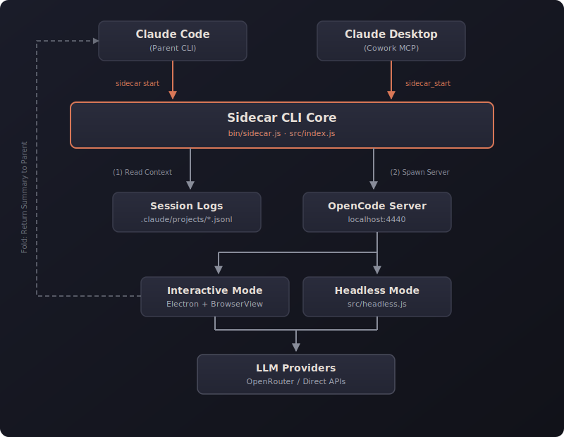

<div align="center">

# 🛸 Claude Sidecar

**Multi-model subagent tool for Claude Code**

Spawn parallel conversations with Gemini, GPT-4, o3, and any other LLM — then fold the results back into your context.

[](https://www.npmjs.com/package/claude-sidecar)
[](https://nodejs.org)
[](./LICENSE)

</div>

---

## The Big Idea: Fork & Fold

Working on a hard problem in Claude Code? Send it to a specialist.

```
┌──────────────────────────────────────────────────────────┐
│  Your Claude Code session                                 │
│                                                           │
│  You: "Debug the auth race condition in TokenManager.ts"  │
│                                                           │
│  Claude: Spawning o3 sidecar for deep reasoning...        │
│                          │                                │
│              ┌───────────▼──────────────┐                 │
│              │  o3 Sidecar              │                 │
│              │  ─ Reads TokenManager.ts │                 │
│              │  ─ Traces the race       │                 │
│              │  ─ Finds root cause      │                 │
│              └───────────┬──────────────┘                 │
│                          │  FOLD                          │
│                          ▼                                │
│  Summary returns → Claude acts on findings                │
└──────────────────────────────────────────────────────────┘
```

1. **Fork** — Spawn a sidecar with the best model for the job (Gemini's 1M context, o3's reasoning, GPT-4's coding)
2. **Work** — The sidecar investigates independently, interactively or autonomously
3. **Fold** — Results summarize back into your Claude Code context, clean and structured

Your main conversation stays focused. Deep explorations stay contained. The right model handles each task.

---

## Why Sidecar?

| Problem | Sidecar's Solution |
|---------|-------------------|
| Claude's context fills up with exploration noise | Sidecars contain the mess; only the summary returns |
| You need Gemini's 1M token context for a large codebase | Route that task to Gemini while Claude keeps working |
| o3's step-by-step reasoning is better for this bug | Fork to o3 without leaving your workflow |
| You want parallel investigation | Background sidecars run while you continue with Claude |
| Context drift from long sessions | Drift detection warns you when sidecar context may be stale |
| File conflicts from async work | Conflict detection catches external changes before you apply results |

---

## Installation

```bash
npm install -g claude-sidecar
```

**Prerequisites:**
- Node.js 18+
- [OpenCode CLI](https://opencode.ai): `npm install -g opencode-ai`

On install, sidecar automatically:
- Registers a **Skill** in `~/.claude/skills/sidecar/` so Claude Code knows how to use sidecars
- Registers an **MCP server** for Claude Desktop and Cowork

### Configure API Access

**Option A: OpenRouter** *(recommended — one key for all models)*

```bash
mkdir -p ~/.local/share/opencode
echo '{"openrouter": {"apiKey": "sk-or-v1-YOUR_KEY"}}' > ~/.local/share/opencode/auth.json
```

**Option B: Direct provider keys**

```bash
export GEMINI_API_KEY=...      # Google models
export OPENAI_API_KEY=...      # OpenAI models
export ANTHROPIC_API_KEY=...   # Anthropic models
```

### Configure Default Model & Aliases

```bash
sidecar setup
```

The interactive wizard sets your default model and 21+ short aliases. After setup, `--model gemini`, `--model opus`, `--model gpt` all just work. Or skip `--model` entirely to use your default.

---

## Quick Start

```bash
# Interactive sidecar — opens a GUI, you converse, click FOLD when done
sidecar start --model gemini --prompt "Debug the auth race condition in TokenManager.ts"

# Headless — autonomous, no GUI, summary returns automatically
sidecar start --model gemini --prompt "Generate Jest tests for src/utils/" --no-ui

# Use a specific reasoning model for a hard problem
sidecar start --model openrouter/openai/o3 --prompt "Find the root cause of the memory leak"

# Full model string works too
sidecar start --model openrouter/google/gemini-2.5-pro --prompt "Analyze the entire codebase architecture"
```

---

## Features

### 🔀 Multi-Model Routing

Route tasks to whichever model is best suited. Use Gemini for its million-token context window, o3 for step-by-step reasoning, or GPT-4 for coding tasks — without leaving Claude Code.

### 🖥️ Interactive + Headless Modes

**Interactive:** Opens an Electron window with the OpenCode UI. You converse with the sidecar, steer the investigation, then click **FOLD** to generate a structured summary. Switch models mid-conversation without restarting.

**Headless (`--no-ui`):** The agent works autonomously. When done, outputs a `[SIDECAR_FOLD]` summary automatically. Ideal for bulk tasks: test generation, documentation, linting.

### 🧠 Adaptive Personality

Sidecar detects its launch context and adapts its persona:
- **From Claude Code** (`--client code-local`): Engineering-focused (debug, implement, review)
- **From Cowork** (`--client cowork`): General-purpose (research, analyze, write, brainstorm)

### 📋 Context Passing

Automatically extracts your Claude Code conversation history and passes it to the sidecar as context. Filter by turns (`--context-turns`) or time window (`--context-since 2h`).

### 🔒 Safety Features

- **Conflict detection**: Warns when files changed externally while the sidecar was running
- **Drift awareness**: Indicates when the sidecar's context may be stale relative to your current session
- **Pre-flight validation**: All CLI inputs are validated before anything launches — no surprise failures mid-run

### 💾 Session Persistence

Every sidecar is persisted. List past sessions, read their summaries, reopen them, or chain them together.

```bash
sidecar list                           # See all past sidecars
sidecar read abc123                    # Read the summary
sidecar resume abc123                  # Reopen the exact session
sidecar continue abc123 --prompt "..." # New session building on previous findings
```

### 🔌 MCP Integration

Full MCP server for Claude Desktop and Cowork. Sidecar tools appear natively inside Cowork's sandboxed environment — no CLI required.

---

## Commands

### `sidecar start` — Launch a Sidecar

```bash
sidecar start --model <model> --prompt "<task>"
```

| Option | Description | Default |
|--------|-------------|---------|
| `--model` | Model to use (alias or full string) | Config default |
| `--prompt` | Task description / briefing | *(required)* |
| `--no-ui` | Headless autonomous mode | false |
| `--agent` | Agent mode: `Chat`, `Plan`, `Build` | `Chat` |
| `--timeout` | Headless timeout in minutes | 15 |
| `--context-turns N` | Max conversation turns to include | 50 |
| `--context-since` | Time filter: `30m`, `2h`, `1d` | — |
| `--context-max-tokens N` | Context size cap | 80000 |
| `--thinking` | Reasoning effort: `none` `minimal` `low` `medium` `high` `xhigh` | `medium` |
| `--summary-length` | Output verbosity: `brief` `normal` `verbose` | `normal` |
| `--session-id` | Explicit Claude Code session ID | Most recent |
| `--mcp` | Add MCP server: `name=url` or `name=command` | — |
| `--mcp-config` | Path to `opencode.json` with MCP config | — |
| `--client` | Client context: `code-local` `code-web` `cowork` | `code-local` |

**Example briefing:**

```bash
sidecar start \
  --model openrouter/google/gemini-2.5-pro \
  --prompt "## Task Briefing

**Objective:** Find the root cause of intermittent 401 errors on mobile

**Background:** Users report sporadic auth failures every 2-4 hours.
Server logs show token refresh race conditions. I suspect TokenManager.ts.

**Files of interest:**
- src/auth/TokenManager.ts
- src/api/client.ts
- logs/auth-errors-2025-01-25.txt

**Success criteria:** Identify root cause and propose a fix

**Constraints:** Focus on auth flow only, don't refactor unrelated code"
```

### `sidecar list` — Browse Past Sessions

```bash
sidecar list                    # Current project
sidecar list --status complete  # Completed only
sidecar list --all              # All projects
sidecar list --json             # JSON output
```

### `sidecar resume` — Reopen a Session

```bash
sidecar resume <task_id>
```

Reopens the exact OpenCode session with full conversation history preserved. Use when you want to pick up exactly where you left off.

### `sidecar continue` — Build on Previous Work

```bash
sidecar continue <task_id> --prompt "Now implement the fix from the analysis"
```

Starts a **new** session with the previous session's conversation as read-only background context. Optionally switch models.

### `sidecar read` — Read Session Output

```bash
sidecar read <task_id>                  # Summary (default)
sidecar read <task_id> --conversation   # Full conversation
sidecar read <task_id> --metadata       # Session metadata
```

### `sidecar setup` — Configure Aliases & Defaults

```bash
sidecar setup                                           # Interactive wizard
sidecar setup --add-alias fast=openrouter/google/gemini-3-flash-preview
```

---

## Agent Modes

Three primary modes control what the sidecar can do autonomously:

| Agent | Reads | Writes/Bash | Best For |
|-------|-------|-------------|----------|
| **Chat** *(default)* | Auto-approved | Asks permission | Questions, analysis, guided exploration |
| **Plan** | Auto-approved | Blocked entirely | Code review, architecture analysis, security audits |
| **Build** | Auto-approved | Auto-approved | Implementation tasks, test generation, headless batch work |

```bash
# Chat — good for analysis with human-in-the-loop on writes (default)
sidecar start --model gemini --prompt "Analyze the auth flow and suggest improvements"

# Plan — strict read-only, no changes possible
sidecar start --model gemini --agent Plan --prompt "Security review of the payment module"

# Build — full autonomy, use when you explicitly want it to write code
sidecar start --model gemini --agent Build --no-ui \
  --prompt "Generate comprehensive Jest tests for src/utils/"
```

> **Headless mode note:** `--no-ui` defaults to `Build`. The `Chat` agent requires interactive UI for write permissions and stalls in headless mode.

---

## Models

### Using Aliases (after `sidecar setup`)

| Alias | Model |
|-------|-------|
| `gemini` | Gemini 3 Flash (fast, 1M context) |
| `opus` | Claude Opus 4.6 (deep analysis) |
| `gpt` | OpenAI GPT-5.2 |
| `deepseek` | DeepSeek v3.2 |
| *(omit `--model`)* | Your configured default |

### Using Full Model Strings

| Access | Format | Example |
|--------|--------|---------|
| OpenRouter | `openrouter/provider/model` | `openrouter/google/gemini-2.5-pro` |
| Direct Google | `google/model` | `google/gemini-2.5-flash` |
| Direct OpenAI | `openai/model` | `openai/gpt-4o` |
| Direct Anthropic | `anthropic/model` | `anthropic/claude-sonnet-4` |

The prefix determines which credentials are used. Model names evolve — verify current names:

```bash
curl https://openrouter.ai/api/v1/models | jq '.data[].id' | grep -i gemini
```

---

## MCP Integration

For Claude Desktop and Cowork, sidecar exposes a full MCP server auto-registered on install.

To register manually:
```bash
claude mcp add-json sidecar '{"command":"sidecar","args":["mcp"]}' --scope user
```

| MCP Tool | Description |
|----------|-------------|
| `sidecar_start` | Spawn a sidecar (returns task ID immediately) |
| `sidecar_status` | Poll for completion |
| `sidecar_read` | Get results: summary, conversation, or metadata |
| `sidecar_list` | List past sessions |
| `sidecar_resume` | Reopen a session |
| `sidecar_continue` | New session building on previous |
| `sidecar_setup` | Open setup wizard |
| `sidecar_guide` | Get usage instructions |

**Async pattern:** `sidecar_start` returns a task ID immediately. Poll with `sidecar_status`, then read results with `sidecar_read`. This is non-blocking — the calling agent can do other work while the sidecar runs.

---

## Understanding Sidecar Output

Every fold produces a structured summary:

```markdown
## Sidecar Results: [Title]

📍 **Context Age:** [How stale the context might be]
⚠️ **FILE CONFLICT WARNING** [If files changed while the sidecar ran]

**Task:** What was requested
**Findings:** Key discoveries
**Attempted Approaches:** What was tried but didn't work
**Recommendations:** Concrete next steps
**Code Changes:** Specific diffs with file paths
**Files Modified:** List of changed files
**Assumptions Made:** Things to verify
**Open Questions:** Remaining uncertainties
```

---

## How It Works



1. **Context extraction** — Sidecar reads your Claude Code session from `~/.claude/projects/[project]/[session].jsonl`
2. **Server spawn** — OpenCode server starts on a local port with your chosen model
3. **Mode selection** — Interactive (Electron BrowserView) or headless (async HTTP API)
4. **Execution** — The agent works; interactive lets you guide it, headless runs autonomously
5. **Fold** — On completion, a structured summary is emitted to stdout
6. **Return** — Claude Code receives the summary and acts on it

The Electron shell uses a **BrowserView** architecture: the OpenCode web UI loads in a dedicated viewport, while the sidecar toolbar (branding, timer, Fold button) renders in the bottom 40px of the host window — no CSS conflicts, no style pollution.

---

## Troubleshooting

| Issue | Fix |
|-------|-----|
| `command not found: opencode` | `npm install -g opencode-ai` |
| 401 Unauthorized / auth errors | Verify model prefix matches credentials (`openrouter/...` needs auth.json) |
| Headless stalls silently | Use `--agent build`, not `--agent chat` in headless mode |
| Session not found | Run `sidecar list`, or omit `--session-id` to use most recent |
| No conversation history found | Check `ls ~/.claude/projects/` — `/` and `_` are encoded as `-` in path |
| Headless timeout | Increase with `--timeout 30` |
| Summary corrupted | Debug output leaking to stdout — use `LOG_LEVEL=debug` to diagnose |
| Multiple active sessions | Pass `--session-id` explicitly |

**Debug logging:**
```bash
LOG_LEVEL=debug sidecar start --model gemini --prompt "test" --no-ui
```

---

## Documentation

| Doc | Description |
|-----|-------------|
| [User Guide](./docs/USER_GUIDE.md) | Non-technical users and Cowork workflows |
| [Developer Guide](./docs/DEVELOPER_GUIDE.md) | Architecture, integration, contribution |
| [SKILL.md](./skill/SKILL.md) | Complete skill reference for Claude Code |

---

## License

MIT — [John Renaldi](https://github.com/jrenaldi79)
